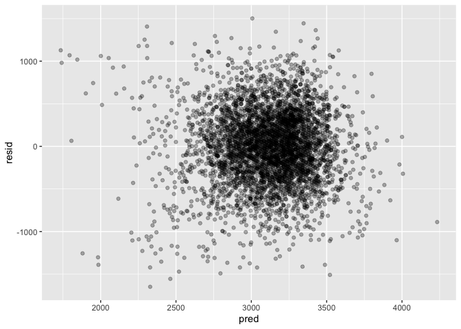
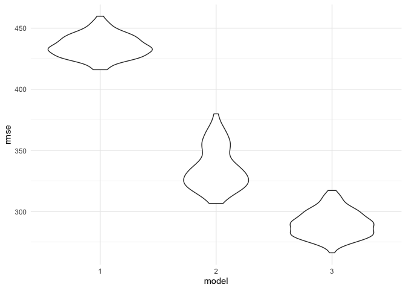

Homework 6
================
Xinyu Yang
11/22/2019

## Problem 1

``` r
birthweight <-
  read_csv("./data/birthweight.csv") %>% 
  janitor::clean_names() %>% 
  filter(frace != 9) %>% 
  select(-pnumlbw,-pnumsga) %>% 
  mutate(
    babysex = as.factor(babysex),
    frace = as.factor(frace),
    mrace = as.factor(mrace),
    malform = as.factor(malform)
  )

#check missing data
apply(is.na(birthweight),2,sum)
```

    ##  babysex    bhead  blength      bwt    delwt  fincome    frace  gaweeks 
    ##        0        0        0        0        0        0        0        0 
    ##  malform menarche  mheight   momage    mrace   parity    ppbmi     ppwt 
    ##        0        0        0        0        0        0        0        0 
    ##   smoken   wtgain 
    ##        0        0

After read in the dataset, no missing value was identified; variables
babysex, frace, mrace, malform were converted into factor; vairalbes
pnumlbw, pnumgsa contained only value of 0, thus were excluded; frace
level 9 (unknown) was also excluded from the analysis.

``` r
#function for bivariate regression
bivariate = function(x) {
  lm(bwt ~ x, data = birthweight) %>% broom::tidy() %>% 
  select(term, estimate, p.value) %>% 
  filter(term != "(Intercept)") %>% 
  mutate(p.value = round(p.value, 4))
}

bivariate_result <-
  birthweight %>% 
  select(-bwt) %>% 
  map_dfr(~bivariate(.), .id = "source")
bivariate_result %>% knitr::kable()
```

| source   | term |     estimate | p.value |
| :------- | :--- | -----------: | ------: |
| babysex  | x2   |  \-88.770460 |  0.0000 |
| bhead    | x    |   236.109040 |  0.0000 |
| blength  | x    |   139.810857 |  0.0000 |
| delwt    | x    |     6.639270 |  0.0000 |
| fincome  | x    |     3.047636 |  0.0000 |
| frace    | x2   | \-313.731272 |  0.0000 |
| frace    | x3   | \-105.796432 |  0.1470 |
| frace    | x4   | \-203.898466 |  0.0000 |
| frace    | x8   |  \-88.535563 |  0.4999 |
| gaweeks  | x    |    66.919907 |  0.0000 |
| malform  | x1   |    11.636238 |  0.9300 |
| menarche | x    |   \-8.465482 |  0.1076 |
| mheight  | x    |    37.048355 |  0.0000 |
| momage   | x    |    17.931595 |  0.0000 |
| mrace    | x2   | \-316.563781 |  0.0000 |
| mrace    | x3   | \-126.430227 |  0.0932 |
| mrace    | x4   | \-211.321222 |  0.0000 |
| parity   | x    |  \-41.673900 |  0.5812 |
| ppbmi    | x    |    15.120374 |  0.0000 |
| ppwt     | x    |     4.645982 |  0.0000 |
| smoken   | x    |   \-5.228867 |  0.0000 |
| wtgain   | x    |    11.570313 |  0.0000 |

After cleaning the data a quick glance on the bivariate relationship
between outcome birthweight and each variable was taken. Variables that
were not significant at alpha = 0.01 level would be excluded from
candicdate variables for model 1; variables that do not hold a temporal
relationship with the outcome (e.g. baby body length, head circumstance)
were not included; for variables that are potentially have a high
co-linearity, one of them would be selected (e.g. selected BMI but
excluded mother’s weight and height; selected mother’s race and excluded
father’s). The final model 1 are shown below, with variables baby’s sex,
gestational age, mother’s age, mother’s race, mother’s pre-delivery BMI,
and mother’s weight gain.

``` r
#fit model 1 with selected vairables
model1 <- lm(bwt ~ babysex + gaweeks + momage + mrace + ppbmi + wtgain, data = birthweight) 
model1 %>% 
  broom::tidy() %>% 
  select(term, estimate, p.value) %>% 
  mutate(
    p.value = round(p.value, 3),
    estimate = round(estimate, 2),
    ) %>% 
  knitr::kable()
```

| term        | estimate | p.value |
| :---------- | -------: | ------: |
| (Intercept) |   441.93 |   0.000 |
| babysex2    |  \-81.04 |   0.000 |
| gaweeks     |    54.27 |   0.000 |
| momage      |     3.08 |   0.098 |
| mrace2      | \-244.67 |   0.000 |
| mrace3      |  \-79.84 |   0.238 |
| mrace4      | \-144.26 |   0.000 |
| ppbmi       |    19.11 |   0.000 |
| wtgain      |     9.68 |   0.000 |

Plot residuals against fitted value

``` r
birthweight %>% 
modelr::add_residuals(model1) %>% 
modelr::add_predictions(model1) %>% 
  ggplot(aes(x = pred, y = resid)) +
  geom_point(alpha = 0.3)
```

<!-- -->

The residual vs. predicted value is relatively shapeless without clear
patterns in the data, and it is generally symmetrically distributed
around the 0
line.

``` r
#model2: length at birth and gestational age as predictors (main effects only)
model2 <- lm(bwt ~ blength + gaweeks, data = birthweight) 

model2 %>% 
  broom::tidy() %>% 
  select(term, estimate, p.value) %>% 
  mutate(
    p.value = round(p.value, 3),
    estimate = round(estimate, 2),
    ) %>% 
  knitr::kable()
```

| term        |  estimate | p.value |
| :---------- | --------: | ------: |
| (Intercept) | \-4347.67 |       0 |
| blength     |    128.56 |       0 |
| gaweeks     |     27.05 |       0 |

``` r
#model3: head circumference, length, sex, and all interactions (including the three-way interaction)
model3 <- lm(bwt ~ (bhead + blength + babysex)^3, data = birthweight)

model3 %>% 
  broom::tidy() %>% 
  select(term, estimate, p.value) %>% 
  mutate(
    p.value = round(p.value, 3),
    estimate = round(estimate, 2),
    ) %>% 
  knitr::kable()
```

| term                   |  estimate | p.value |
| :--------------------- | --------: | ------: |
| (Intercept)            | \-7176.82 |   0.000 |
| bhead                  |    181.80 |   0.000 |
| blength                |    102.13 |   0.000 |
| babysex2               |   6374.87 |   0.000 |
| bhead:blength          |    \-0.55 |   0.478 |
| bhead:babysex2         |  \-198.39 |   0.000 |
| blength:babysex2       |  \-123.77 |   0.000 |
| bhead:blength:babysex2 |      3.88 |   0.000 |

Cross validation to compare models:

``` r
cv_df = 
  crossv_mc(birthweight, 100)

cv_df =
  cv_df %>% 
  mutate(
    train = map(train, as_tibble),
    test = map(test, as_tibble))

cv_df = 
  cv_df %>% 
  mutate(
    mod_1 = map(train, ~lm(bwt ~ babysex + gaweeks + momage + mrace + ppbmi + wtgain, data = .x)),
    mod_2 = map(train, ~lm(bwt ~ blength + gaweeks, data = .x)),
    mod_3 = map(train, ~lm(bwt ~ (bhead + blength + babysex)^3, data = .x))
    ) %>% 
  mutate(
    rmse_1 = map2_dbl(mod_1, test, ~rmse(model = .x, data = .y)),
    rmse_2 = map2_dbl(mod_2, test, ~rmse(model = .x, data = .y)),
    rmse_3 = map2_dbl(mod_3, test, ~rmse(model = .x, data = .y)))

cv_df %>% 
  select(starts_with("rmse")) %>% 
  pivot_longer(
    everything(),
    names_to = "model", 
    values_to = "rmse",
    names_prefix = "rmse_") %>% 
  mutate(model = fct_inorder(model)) %>% 
  ggplot(aes(x = model, y = rmse)) + geom_violin() +
  theme_minimal()
```

<!-- -->

From the violin plot we can see that the prediction error is the lowest
with model 3 (using head circumference, length, sex, and all
interactions).

## Problem 2

``` r
#read in dataset
weather_df = 
  rnoaa::meteo_pull_monitors(
    c("USW00094728"),
    var = c("PRCP", "TMIN", "TMAX"), 
    date_min = "2017-01-01",
    date_max = "2017-12-31") %>%
  mutate(
    name = recode(id, USW00094728 = "CentralPark_NY"),
    tmin = tmin / 10,
    tmax = tmax / 10) %>%
  select(name, id, everything())

temperature <-
weather_df %>% 
  select(tmax, tmin)
```

Bootstrap samples:

``` r
boot_sample = function(df) {
  sample_frac(df, replace = TRUE)
}

boot_straps = 
  data_frame(
    strap_number = 1:5000,
    strap_sample = rerun(5000, boot_sample(temperature))
  )

bootstrap_results = 
  boot_straps %>% 
  mutate(
    models = map(strap_sample, ~lm(tmax ~ tmin, data = .x) ),
    results = map(models, broom::tidy),
    overall = map(models, broom::glance)) 

#log(beta0*beta1) and its 95% CI
log_beta <-
  bootstrap_results %>% 
  select(-strap_sample, -models, -overall) %>% 
  unnest(cols = c(results)) %>% 
  select(strap_number, term, estimate) %>% 
  pivot_wider(names_from = term, values_from = estimate) %>% 
  rename(beta0 = "(Intercept)", beta1 = tmin) %>% 
  mutate(log_beta = log((beta0*beta1))) %>% 
  summarise(log_95 = list(enframe(quantile(log_beta, probs = c(0.025, 0.5, 0.975))))) %>% 
  unnest() %>% 
  rename(percentile = name)
log_beta %>% 
  knitr::kable()
```

| percentile |    value |
| :--------- | -------: |
| 2.5%       | 1.965734 |
| 50%        | 2.013786 |
| 97.5%      | 2.057868 |

The 95% confidence interval for \*\*log(beta0\*beta1)\*\* is 1.966 to
2.058

``` r
#r-squared and 95% CI
r_squared <-
  bootstrap_results %>% 
  select(-strap_sample, -models, -results) %>% 
  unnest(cols = c(overall)) %>% 
  janitor::clean_names() %>% 
  select(r_squared) %>% 
  summarise(r_95 = list(enframe(quantile(r_squared, probs = c(0.025, 0.5, 0.975))))) %>% 
  unnest() %>% 
  rename(percentile = name)
r_squared %>% 
  knitr::kable()
```

| percentile |     value |
| :--------- | --------: |
| 2.5%       | 0.8947118 |
| 50%        | 0.9117061 |
| 97.5%      | 0.9275321 |

The 95% confidence interval for **r-squared** is 0.895 to 0.928
